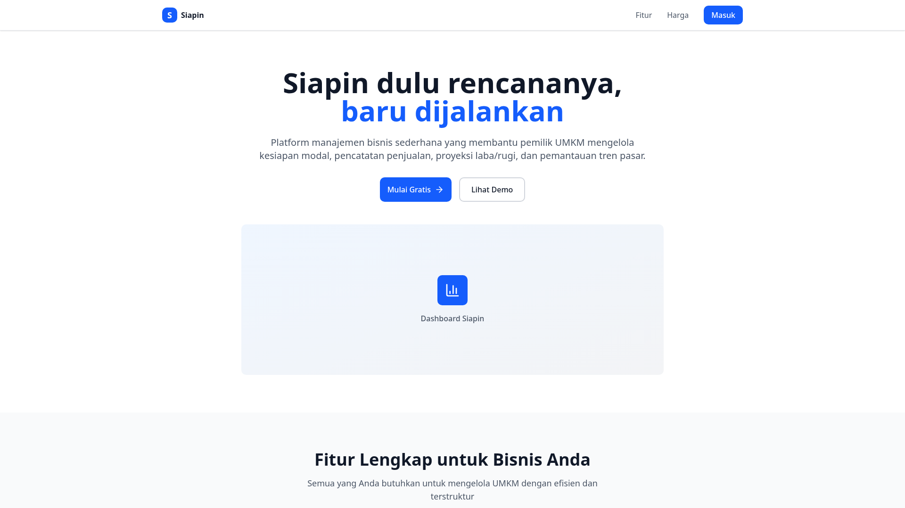
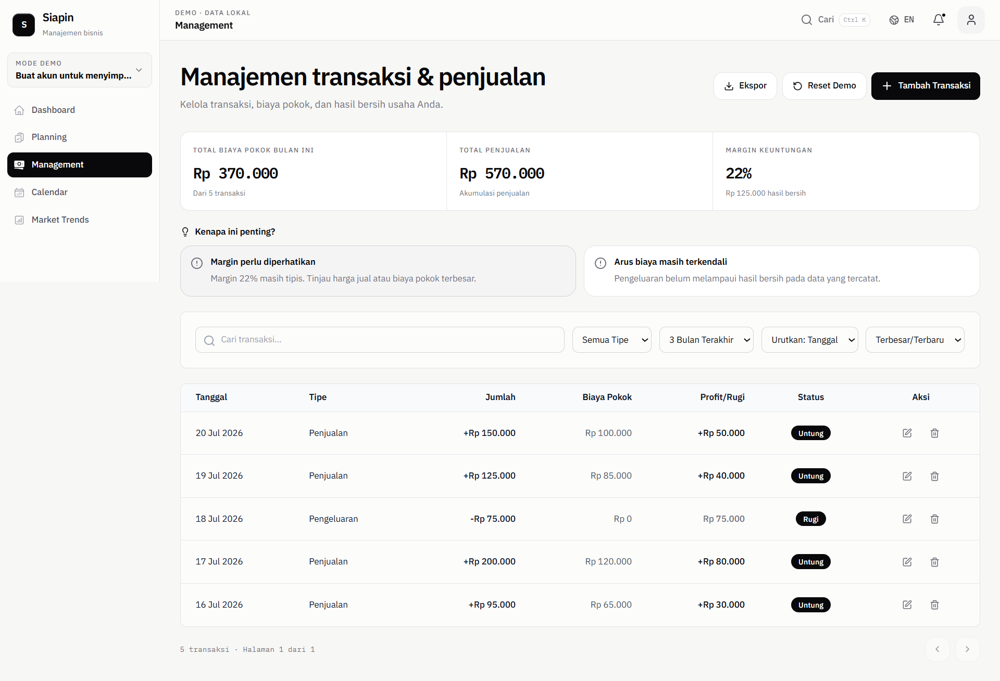
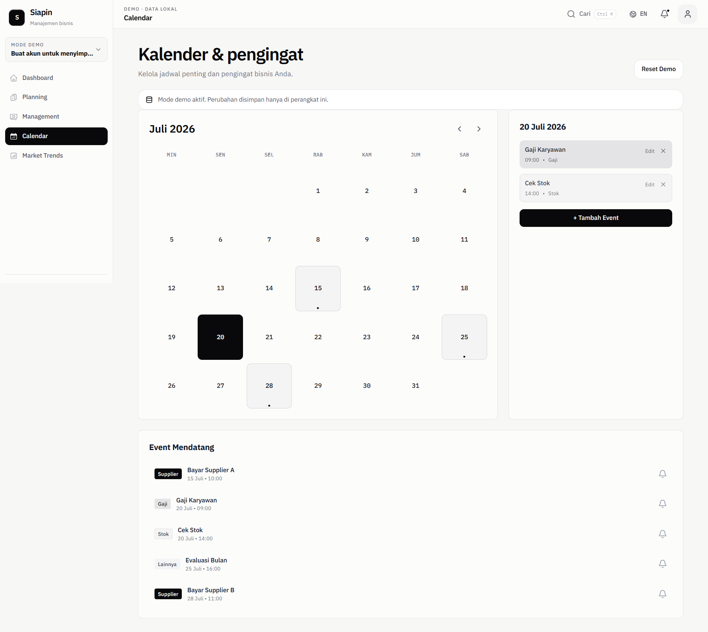
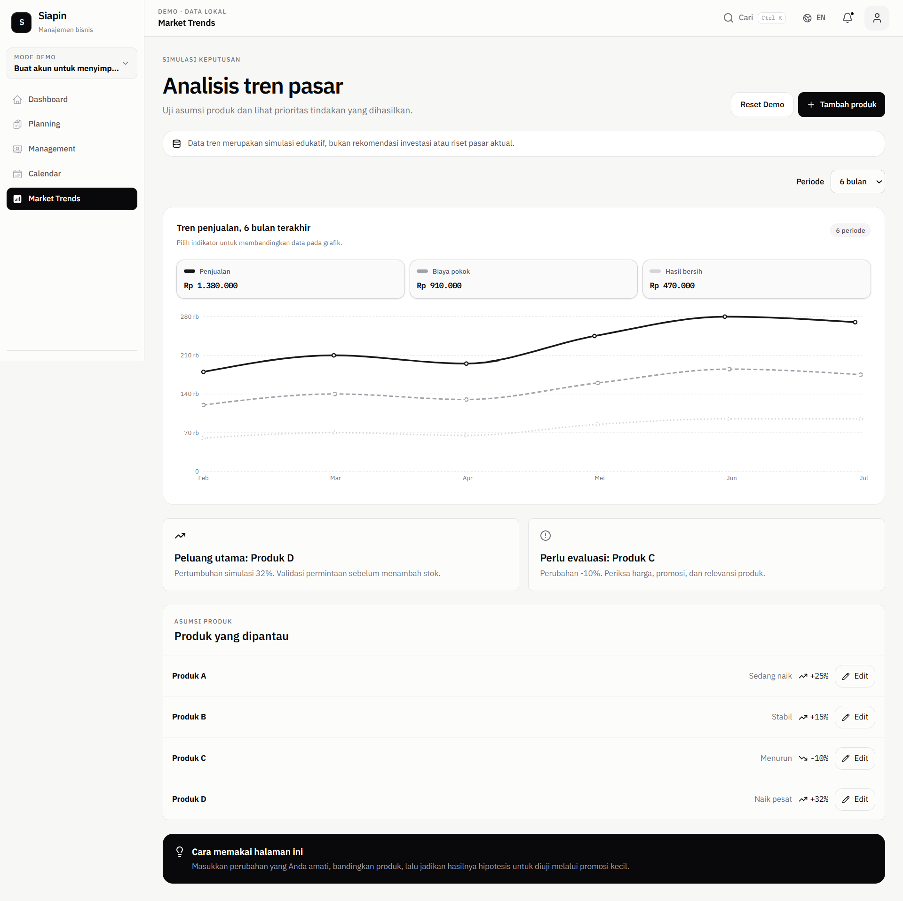
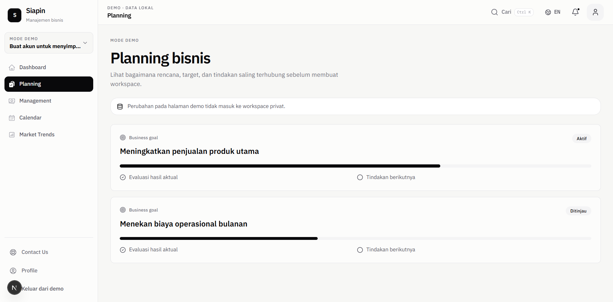

# Siapin: Plan it first, then make it happen.

> An open-source workspace that helps small businesses turn plans into real results.


<p>
  <a href="https://github.com/GavinArdhijaya91/management-plan/actions"></a>
  <a href="./CONTRIBUTING.md"></a>
  <a href="./SECURITY.md"></a>
  <a href="./LICENSE"></a>
</p>

**Try it without signing up:** open `/demo` after you run the project locally. All demo data is fake and isolated from real workspaces.

---

## What is Siapin?

Siapin is a simple, private workspace for small business owners and small teams.

Most teams already work hard. The problem is not effort but it is that important things are scattered:

- plans live in a document,
- sales and expenses live in another app or notebook,
- tasks live in chat,
- and reviews only happen when something goes wrong.

**Siapin brings those pieces together in one loop:**

```
Plan → Goal → Initiative → Action → Actual Result → Review → Next Decision
```

1.  **Plan**: where are we going?
2.  **Goal + Target**: what does success look like, in numbers?
3.  **Initiative**: what is the strategy to get there?
4.  **Action**: who does what, by when?
5.  **Actual Result**: what really happened?
6.  **Review**: what did we learn, and what will we do next?

If you can follow this loop, you can use Siapin. No business degree needed.

> **Current status:** Siapin is a **self-hostable preview**. You can run it, learn from it, and help build it. It is not a hosted service yet and it is not ready to store real business or personal data in production. See [Release and Hosting Strategy](./docs/RELEASE_AND_HOSTING_STRATEGY.md).

---

## Why did we build this? (The real-world problem)

We talked to many small business owners (UMKM) in Indonesia. The same story came up again and again:

**They have big dreams, but they don't have a shared system to guide daily decisions.**

- A plan is written once and then forgotten.
- Daily transactions are not connected to the plan, so owners cannot see if they are on track.
- Team members are not sure who is responsible for what.
- When it is time to review, there is no clear evidence, so the only things are memory and feeling only.

This has a social impact. When a small business cannot see what is working, it is harder to grow, hire, or survive a tough month. Good ideas fail not because they are bad, but because the follow-through is invisible.

**Siapin tries to solve both sides:**

- **Practical side:** connect planning, doing, and measuring in one private place, with clear roles so everyone knows what they can see and do.
- **Human side:** use simple language that non-technical people understand, make progress visible, and keep private business data truly private.

Siapin does not replace an accountant, a mentor, or your own judgment. It just makes your thinking visible, so your team can talk about it and improve together.

---

## Who is Siapin for?

- **Small business owners** who want a clearer way to plan and check progress.
- **Small teams (range 2–20 people)** who need a private space with roles like Owner, Manager, Member, Viewer, and custom roles if needed.
- **Students, builders, and contributors** who want to learn how real business software is designed and built.
- **Designers and writers** who care about making business tools friendly for everyone, not just experts.

You do not need to be a developer to contribute. Better words, clearer docs, bug reports, and accessibility checks are real contributions.

---

## What can you do today?

| Area                           | What exists now                                                                                          |
| ------------------------------ | -------------------------------------------------------------------------------------------------------- |
| **Explore without an account** | Public demo pages at `/demo`                                                                             |
| **Workspace**                  | Sign up, create a workspace, invite teammates, set roles & permissions                                   |
| **Planning loop**              | Create plans, goals, initiatives, action items, measurable targets, actual results, and business reviews |
| **Money**                      | Record simple transactions and link them to goals                                                        |
| **Calendar & more**            | Calendar, notifications, profile, community posts, and a curated portfolio of finished reviews           |
| **Safety**                     | PostgreSQL (Supabase) with Row Level Security on your workspace cannot see another workspace's data      |
| **Quality**                    | Unit tests, database security contracts, and Playwright end-to-end tests                                 |

What is next is tracked honestly in [ROADMAP.md](./ROADMAP.md) and [Product Direction](./docs/PRODUCT_DIRECTION.md).

---

## Screenshots

| Landing                           | Dashboard                             | Management                             | Calendar                            |
| --------------------------------- | ------------------------------------- | -------------------------------------- | ----------------------------------- |
|  |  |  |  |

| Market Trends                                 | Planning                            |
| --------------------------------------------- | ----------------------------------- |
|  |  |

Mobile is also supported for same pages, adapted for small screens.

---

## Get started from zero to running (5–10 minutes)

This is the full setup, start to end. No step is skipped.

### 1. What you need before you start

- **Node.js 22.13 or newer**: check with `node -v`
- **Git**
- **pnpm** via Corepack (comes with Node.js): check with `pnpm -v`
- A free **Supabase** account at https://supabase.com

> On Windows, you will use PowerShell. On Mac/Linux, you will use Terminal. Commands are almost the same, we note the difference where it matters.

### 2. Get the code

```bash
git clone https://github.com/GavinArdhijaya91/management-plan.git
cd management-plan
```

### 3. Install the app

```bash
corepack enable pnpm
pnpm install
```

### 4. Create your environment file

```bash
# Mac / Linux
cp .env.example .env.local

# Windows PowerShell
Copy-Item .env.example .env.local
```

Open `.env.local` in any text editor and fill it in:

```env
NEXT_PUBLIC_SUPABASE_URL=https://your-project.supabase.co
NEXT_PUBLIC_SUPABASE_PUBLISHABLE_KEY=sb_publishable_your_key
NEXT_PUBLIC_SITE_URL=http://localhost:3000
SUPABASE_SECRET_KEY=
```

Where to find those two Supabase values:

1. Create a new project at https://supabase.com/dashboard
2. Go to **Project Settings → API**
3. Copy **Project URL** → paste as `NEXT_PUBLIC_SUPABASE_URL`
4. Copy **publishable key** (starts with `sb_publishable_`) → paste as `NEXT_PUBLIC_SUPABASE_PUBLISHABLE_KEY`

Leave `SUPABASE_SECRET_KEY` empty for local development. Never commit `.env.local`.

### 5. Set up the database

Siapin uses Supabase migrations to create tables and security rules.

```bash
# Link your local project to Supabase (first time only)
pnpm db:link

# Check what will change (safe, no changes yet)
pnpm db:dry-run

# Apply migrations
pnpm db:push
```

If you prefer to run Supabase locally with Docker:

```bash
npx supabase start
npx supabase db reset
```

> Database rule: never edit a migration that has already been applied. Always create a new one. See [Database Conventions](./docs/DATABASE_CONVENTIONS.md).

### 6. Run the app

```bash
pnpm dev
```

Open http://localhost:3000

You should see the landing page. Try the demo at http://localhost:3000/demo -> no account needed.

Create an account to try the full workspace flow: Plan → Goal → Initiative → Action → Result → Review.

### 7. Check that everything works

```bash
pnpm verify   # runs tests + typecheck + lint + format check + build
```

Other useful commands:

```bash
pnpm typecheck      # check TypeScript
pnpm lint           # check code style
pnpm format:check   # check formatting
pnpm test           # unit tests (Vitest)
pnpm test:e2e       # browser tests (Playwright)
pnpm build          # production build
```

If something fails, see [Troubleshooting](#troubleshooting) below.

---

## How the project is organized

```text
app/         pages, API routes, and feature modules
components/  shared UI components
data/        fake demo data (never real business data)
lib/         helpers, domain logic, Supabase clients
public/      images and static files
supabase/    database migrations, config, seed, and security tests
docs/        deeper docs: domain, security, operations, release notes
e2e/         Playwright browser tests
scripts/     helper scripts (image optimization, data checks, etc.)
```

Want to understand the business terms? Start with [Domain Glossary](./docs/DOMAIN_GLOSSARY.md). It explains words like Plan, Goal, Initiative, Action, and Review in one place, and we use the same words in code, database, and UI.

---

## Tech stack (simple version)

- **Next.js 16** (App Router) + **TypeScript**: the web framework
- **Tailwind CSS + shadcn/ui**: styling and UI components
- **Supabase (PostgreSQL + Auth + RLS)**: database, login, and row-level security
- **Vitest + Playwright**: unit tests and browser tests
- **pnpm**: package manager

You do not need to know all of these to contribute. Docs and small issues are a great first step.

---

## Want to contribute?

We would love your help and it does not have to be code.

- Fix a typo or make an explanation clearer
- Report a bug with steps to reproduce it
- Suggest better wording for a button or page
- Add or improve a test
- Check accessibility with keyboard only

**Start here:**

1. Read [CONTRIBUTING.md](./CONTRIBUTING.md): the full but friendly guide
2. Look at [ROADMAP.md](./ROADMAP.md): what we are focusing on now
3. Pick a beginner-friendly task in [Good First Issues](./docs/GOOD_FIRST_ISSUES.md)
4. Learn the language in [Domain Glossary](./docs/DOMAIN_GLOSSARY.md)

Please be kind and respectful. See [Code of Conduct](./CODE_OF_CONDUCT.md).

---

## Troubleshooting

**`pnpm` not found?**

```bash
corepack enable pnpm
corepack prepare pnpm@latest --activate
```

**Styles not loading or page is blank?**

```bash
rm -rf .next
pnpm dev
```

**Database error / RLS error?**

- Make sure `.env.local` has the correct Supabase URL and publishable key
- Run `pnpm db:status` to see if migrations are applied
- Never disable RLS to make a query work to ask for help in an issue instead

**Still stuck?**
Open an issue with: what you did, what you expected, what you saw, and your Node/pnpm version. Or see [SUPPORT.md](./SUPPORT.md).

---

## Security

If you find a security problem, please **do not** open a public issue. See [SECURITY.md](./SECURITY.md) for how to report it privately. We take workspace isolation and data privacy seriously.

---

## License

This project is licensed under the [MIT License](./LICENSE).

You are free to use, copy, modify, and share it including for commercial use as long as you keep the original copyright notice. See `LICENSE` for the full text.

Copyright (c) 2026 Siapin Contributors.

---

## Acknowledgments

Siapin is built for small business owners who keep going even when it is hard. Thank you to everyone who shares feedback, reports bugs, improves words, and helps make business planning more human.

If Siapin helps you, a star ⭐ on GitHub helps others find it.

---

<p align="center">
  <sub>Built with care for small teams. Private data stays private. Demo data stays separate.</sub>
</p>
