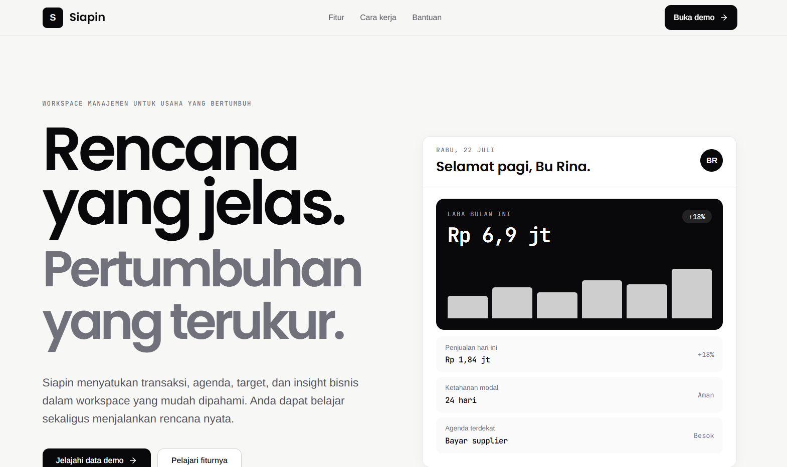

# Siapin

**Plan it first, then make it happen.**

Siapin is a business management application designed to help MSME owners manage transactions, profit and loss, schedules, product trends, notifications, and workspace profiles in one place.



## Technology stack

- Next.js 16 with App Router and Route Handlers
- React 19
- TypeScript
- Tailwind CSS 4
- PostgreSQL through Supabase
- Supabase Auth and Row Level Security
- Typed client-side language dictionaries
- React Hook Form and Zod
- Recharts
- Vitest
- pnpm

## Prerequisites

Make sure your system has:

- [Node.js](https://nodejs.org/) 22.13 or newer
- [Corepack](https://nodejs.org/api/corepack.html)
- A [Supabase](https://supabase.com/) account and project
- Git

This repository uses pnpm. Avoid creating a `package-lock.json` or installing dependencies with npm.

Docker is only required when running the complete Supabase stack locally. The basic setup below uses a hosted Supabase project, so Docker is optional.

## Local setup

### 1. Clone the repository

```bash
git clone <REPOSITORY_URL>
cd management-plan
```

Replace `<REPOSITORY_URL>` with this repository's GitHub URL.

### 2. Enable pnpm

```bash
corepack enable pnpm
```

### 3. Install dependencies

```bash
pnpm install
```

### 4. Configure the environment

Copy `.env.example` to `.env.local`.

PowerShell:

```powershell
Copy-Item .env.example .env.local
```

Bash:

```bash
cp .env.example .env.local
```

Fill in `.env.local`:

```env
NEXT_PUBLIC_SUPABASE_URL=https://your-project.supabase.co
NEXT_PUBLIC_SUPABASE_PUBLISHABLE_KEY=sb_publishable_your_key
NEXT_PUBLIC_SITE_URL=http://localhost:3000
SUPABASE_SECRET_KEY=
```

The Project URL and publishable key are available from **Connect** or **Settings > API Keys** in the Supabase Dashboard.

`SUPABASE_SECRET_KEY` may remain empty until the application needs administrative operations. When used, it must have the `sb_secret_...` format, remain server-only, and never use the `NEXT_PUBLIC_` prefix.

Never commit `.env.local`. It is already excluded by `.gitignore`.

## Supabase PostgreSQL setup

### 1. Find the project reference

The project reference is the identifier in the Supabase Dashboard URL:

```text
https://supabase.com/dashboard/project/PROJECT_REF
```

The project reference is not the Project URL, publishable key, secret key, or database password.

### 2. Sign in with the Supabase CLI

```bash
pnpm supabase login
```

### 3. Link the repository to the project

```bash
pnpm db:link --project-ref PROJECT_REF
```

The CLI may request the database password created with the Supabase project.

### 4. Check migration status

```bash
pnpm db:status
```

### 5. Preview the initial migration

```bash
pnpm db:push --dry-run
```

Review the output before continuing. The initial migration is located at:

```text
supabase/migrations/20260722000000_initial_management_schema.sql
```

The migration creates:

- `profiles`
- `workspaces`
- `workspace_members`
- `transactions`
- `calendar_events`
- `market_products`
- `market_snapshots`
- `notifications`
- `contact_messages`
- `audit_logs`
- Constraints, foreign keys, and indexes
- `updated_at` triggers
- Automatic profile creation after registration
- An atomic workspace creation function
- Row Level Security and workspace roles

### 6. Apply the migration

When the dry run output is correct:

```bash
pnpm db:push
```

Never reset a production project. Seed data is intended for development and staging environments only.

### 7. Generate TypeScript database types

PowerShell:

```powershell
pnpm db:types | Set-Content lib/supabase/database.types.ts
```

Bash:

```bash
pnpm db:types > lib/supabase/database.types.ts
```

Regenerate this file whenever the PostgreSQL schema changes. Do not edit generated database types manually.

## Supabase Auth configuration

Open **Authentication > URL Configuration** in the Supabase Dashboard.

Use the following development configuration:

```text
Site URL: http://localhost:3000
Redirect URL: http://localhost:3000/**
```

Use the official domain and specific redirect URLs in production.

Then open **Authentication > Providers > Email** and enable the Email provider. Email confirmation may be simplified during development but should be enabled in production.

## Running the application

```bash
pnpm dev
```

Open [http://localhost:3000](http://localhost:3000). Press `Ctrl+C` to stop the development server.

The API health endpoint is available at:

```text
GET http://localhost:3000/api/health
```

This endpoint only reports the service status and whether the Supabase environment is configured. It does not expose keys or secrets.

## Available pages

| Page                   | Local URL                                                         |
| ---------------------- | ----------------------------------------------------------------- |
| Landing page           | [localhost:3000](http://localhost:3000)                           |
| Dashboard              | [localhost:3000/dashboard](http://localhost:3000/dashboard)       |
| Business planning      | [localhost:3000/planning](http://localhost:3000/planning)         |
| Transaction management | [localhost:3000/manajemen](http://localhost:3000/manajemen)       |
| Calendar               | [localhost:3000/kalender](http://localhost:3000/kalender)         |
| Market trends          | [localhost:3000/tren-pasar](http://localhost:3000/tren-pasar)     |
| Contact                | [localhost:3000/hubungi-kami](http://localhost:3000/hubungi-kami) |
| Notifications          | [localhost:3000/notifikasi](http://localhost:3000/notifikasi)     |
| Profile                | [localhost:3000/profil](http://localhost:3000/profil)             |

## Language support

The shared application navigation currently supports six persisted interface languages:

| Region  | Country reference | Language         | Locale |
| ------- | ----------------- | ---------------- | ------ |
| Asia    | Indonesia         | Bahasa Indonesia | `id`   |
| Asia    | Japan             | Japanese         | `ja`   |
| America | United States     | English          | `en`   |
| America | Mexico            | Spanish          | `es`   |
| Europe  | France            | French           | `fr`   |
| Europe  | Germany           | German           | `de`   |

The selected locale is stored under `siapin:locale` in local storage. Typed dictionaries are located in `app/_i18n`, while the selector is a shared component. Route-specific content can be migrated into the same dictionary structure incrementally.

## Quality gates

Run these commands before committing or opening a pull request:

```bash
pnpm typecheck
pnpm lint
pnpm format:check
pnpm test
pnpm build
```

## Image optimization and SEO assets

Raster assets in `public/` support PNG, JPG, and JPEG source files. Generate
their optimized WebP counterparts with:

```bash
pnpm images:optimize
```

Verify that every public raster source has a generated WebP file:

```bash
pnpm images:check
```

Regenerate the 1200×630 Open Graph and social-sharing preview from
`Siapin.png`:

```bash
pnpm images:og
```

SVG assets remain vector files and are not converted to WebP. Trusted SVG
files can be stored in `public/` and referenced using paths such as
`/icon.svg`. Do not publish untrusted user-uploaded SVG files because they may
contain active content.

Run all image checks and project quality gates together:

```bash
pnpm verify
```

See [Asset and SEO Guide](./docs/ASSET_AND_SEO_GUIDE.md) for resize options,
SEO routes, social metadata, and SVG security guidance.

To test the production build locally:

```bash
pnpm build
pnpm start
```

## Project scripts

| Command                | Purpose                                       |
| ---------------------- | --------------------------------------------- |
| `pnpm dev`             | Start the development server                  |
| `pnpm typecheck`       | Check TypeScript types                        |
| `pnpm lint`            | Run ESLint                                    |
| `pnpm format`          | Format supported project files with Prettier  |
| `pnpm format:check`    | Verify formatting without changing files      |
| `pnpm images:optimize` | Convert public PNG/JPG/JPEG assets to WebP    |
| `pnpm images:check`    | Verify public raster assets have WebP output  |
| `pnpm images:og`       | Regenerate the 1200×630 social preview        |
| `pnpm data:check`      | Validate database and presentation boundaries |
| `pnpm test`            | Run Vitest unit tests                         |
| `pnpm build`           | Create a production build                     |
| `pnpm start`           | Start the production build                    |
| `pnpm db:link`         | Link the repository to a Supabase project     |
| `pnpm db:status`       | Compare local and remote migrations           |
| `pnpm db:push`         | Apply pending database migrations             |
| `pnpm db:types`        | Generate database types to standard output    |
| `pnpm db:test`         | Run SQL contracts on local isolated Supabase  |

## Project structure

```text
.
|-- app/                    # Pages, feature modules, and Route Handlers
|   `-- api/                # HTTP API boundary
|-- components/             # Shared React components
|-- data/                   # App-first demo data
|-- lib/
|   `-- supabase/           # Browser and server database clients
|-- public/                 # Static assets
|-- supabase/
|   |-- migrations/         # Versioned PostgreSQL schema
|   |-- config.toml         # Local Supabase configuration
|   `-- seed.sql            # Development seed template
`-- types/                  # Shared TypeScript types
```

## Contributing and domain language

Before adding a feature or database table, read:

- [Contributing guide](./CONTRIBUTING.md)
- [Domain glossary](./docs/DOMAIN_GLOSSARY.md)
- [Database conventions](./docs/DATABASE_CONVENTIONS.md)

These documents define the difference between plans, goals, metrics,
initiatives, actions, schedules, reviews, members, and external partners.
Product UI may be translated, while code and database identifiers remain in
consistent English.

## Security

- Never commit `.env.local`.
- Never use the secret key in a Client Component.
- Do not disable RLS to work around query issues.
- Treat the active-workspace cookie as a UI preference only. Authorization must use the authenticated database user, active membership, canonical workspace role, and effective permissions.
- Never run `db reset --linked` against production.
- Create a new migration when changing an applied schema.
- Add rate limiting before exposing contact, upload, export, or integration endpoints.

## Authentication and workspace session

The private backend flow is:

```text
sign up -> confirm email -> exchange auth code -> authenticated cookie session
        -> create/select workspace -> validate active membership
        -> resolve canonical role and effective permissions -> private page
```

The Next.js proxy refreshes Supabase cookies and performs an optimistic route
check. Server Components and Server Actions repeat the authoritative check with
`supabase.auth.getUser()`. Workspace access is resolved by
`get_my_workspace_access()`, which only returns memberships belonging to
`auth.uid()`.

Apply migrations and regenerate database types before testing a newly linked
environment:

```bash
pnpm db:status
pnpm db:dry-run
pnpm db:push
pnpm db:types
pnpm verify
```

Supabase Auth must allow the application origin and
`/auth/callback?next=/workspace/select` as redirect URLs. Email confirmation
must also be configured in the Supabase project according to the target
environment.

## Continuous integration

GitHub Actions runs two read-only workflows for pushes to `main` and pull requests:

- `Format` verifies that supported source and documentation files match the committed Prettier configuration.
- `CI` installs the frozen pnpm lockfile, checks TypeScript, runs ESLint and unit tests, and creates a production build.

Deployment is intentionally excluded. Continuous delivery will be introduced only after the production environment and release policy are defined.

## Development status

Authentication, cookie session refresh, private-route protection, workspace
onboarding, active-workspace selection, and role/permission resolution are
integrated. Planning reads live workspace data and routes lifecycle mutations
through validated Server Actions plus canonical Supabase RPCs. The remaining
business feature pages still use clearly marked demo/local-storage data; their
Supabase integration remains a separate phase.
