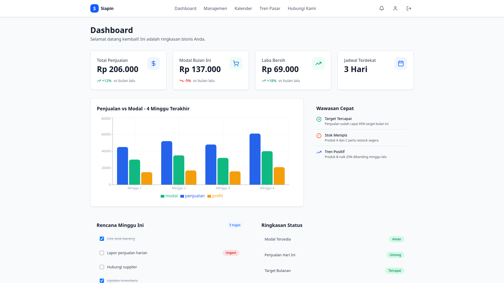

# Siapin

**Siapin dulu rencananya, baru dijalankan.**

Siapin adalah website manajemen bisnis untuk membantu pemilik UMKM memantau modal, penjualan, laba/rugi, jadwal, dan tren pasar dalam satu tempat.



## Teknologi

- Next.js 16 dengan App Router
- React 19
- TypeScript
- Tailwind CSS v4
- Recharts
- Lucide React
- pnpm

## Menjalankan di komputer lokal

### Prasyarat

Pastikan perangkat sudah memiliki:

- [Node.js](https://nodejs.org/) versi 20.9 atau lebih baru
- [Corepack](https://nodejs.org/api/corepack.html), biasanya sudah tersedia bersama Node.js

Project ini menggunakan **pnpm**. Jangan membuat `package-lock.json` atau memasang dependency menggunakan npm.

### 1. Clone repository

```bash
git clone <URL_REPOSITORY>
cd management-plan
```

Ganti `<URL_REPOSITORY>` dengan URL repository GitHub ini.

### 2. Aktifkan pnpm

```bash
corepack enable pnpm
```

Perintah ini cukup dijalankan sekali pada perangkat yang belum mengaktifkan pnpm.

### 3. Pasang dependency

```bash
pnpm install
```

### 4. Jalankan development server

```bash
pnpm dev
```

Buka [http://localhost:3000](http://localhost:3000) di browser. Perubahan kode akan diperbarui otomatis selama development server berjalan.

Untuk menghentikan server, tekan `Ctrl+C` pada terminal.

## Halaman yang tersedia

| Halaman | URL lokal |
| --- | --- |
| Landing page | [localhost:3000](http://localhost:3000) |
| Dashboard | [localhost:3000/dashboard](http://localhost:3000/dashboard) |
| Manajemen transaksi | [localhost:3000/manajemen](http://localhost:3000/manajemen) |
| Kalender | [localhost:3000/kalender](http://localhost:3000/kalender) |
| Tren pasar | [localhost:3000/tren-pasar](http://localhost:3000/tren-pasar) |
| Hubungi kami | [localhost:3000/hubungi-kami](http://localhost:3000/hubungi-kami) |

## Pemeriksaan sebelum commit

```bash
pnpm typecheck
pnpm lint
pnpm build
```

`pnpm build` membuat production build dan memastikan seluruh route dapat dikompilasi.

Untuk mencoba production build secara lokal:

```bash
pnpm build
pnpm start
```

Kemudian buka kembali [http://localhost:3000](http://localhost:3000).

## Script project

| Perintah | Fungsi |
| --- | --- |
| `pnpm dev` | Menjalankan development server |
| `pnpm typecheck` | Memeriksa tipe TypeScript |
| `pnpm lint` | Memeriksa kualitas kode dengan ESLint |
| `pnpm build` | Membuat production build |
| `pnpm start` | Menjalankan production build |

## Struktur folder

```text
.
├── app/            # Route dan halaman Next.js
├── components/     # Komponen React reusable
├── data/           # Mock dan static data
├── docs/           # Design system dan panduan Figma
├── lib/            # Utility bersama
├── public/         # Aset statis yang disajikan oleh Next.js
└── types/          # TypeScript types yang dipakai lintas fitur
```

Dokumentasi desain dapat dimulai dari [docs/FIGMA_START_HERE.md](./docs/FIGMA_START_HERE.md). Panduan pengembangan tambahan tersedia di [docs/GETTING_STARTED.md](./docs/GETTING_STARTED.md).

## Status

Project masih dalam tahap implementasi. Data pada dashboard dan halaman manajemen saat ini menggunakan mock data lokal dari folder `data/`.
