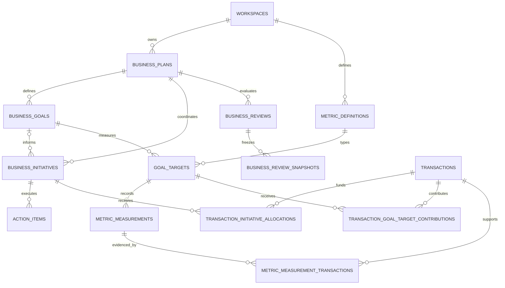

# Planning Domain ERD

This document is the contributor-facing map of Siapin's canonical planning
loop. The executable source of truth remains the ordered migrations in
`supabase/migrations`; this diagram explains their business meaning and must be
updated when those relationships change.

## Canonical relationship map



The shortest user-facing path is:

```text
business_plans
  -> business_goals
  -> business_initiatives
  -> action_items
  -> metric_measurements / linked transactions
  -> business_reviews
  -> next decision
```

Goals and initiatives are intentionally not a strict one-to-one chain. An
initiative always belongs to a plan but may be unlinked from a goal. This lets
teams record necessary operational work without inventing a false outcome.

## Aggregate responsibilities

| Aggregate | Responsibility | Important boundary |
| --- | --- | --- |
| `business_plans` | Time-bounded direction and lifecycle root | Child records inherit workspace and plan visibility. |
| `business_goals` | Desired outcome | A goal is not the work used to achieve it. |
| `goal_targets` | Measurable target for one goal and metric | Unit, direction, target date, and weight remain explicit. |
| `business_initiatives` | Coordinated strategy or program | Belongs to exactly one plan; goal linkage is optional. |
| `action_items` | Concrete assignable work | Belongs to exactly one initiative. |
| `metric_measurements` | Observed actual result | Source is evidence metadata, not an instruction to average values. |
| `business_reviews` | Evaluation for a plan and period | Finalization uses canonical RPCs and immutable evidence snapshots. |

## Relational invariants

- Every tenant-owned row carries `workspace_id`.
- Composite foreign keys bind a child to a parent in the same workspace.
- A plan date range cannot end before it starts.
- Initiative and action date ranges cannot end before they start.
- A completed action has `completed_at`; a non-completed action does not.
- One goal cannot define the same metric target twice.
- One plan cannot have duplicate review periods.
- Restricted-plan visibility propagates through goals, targets, initiatives,
  actions, measurements, reviews, and derived reads.
- Archived or finalized evidence is changed only through its canonical
  lifecycle boundary; browser CRUD is not authoritative.

## Implementation evidence

| Concern | Authoritative source |
| --- | --- |
| Core tables and foreign keys | `20260723010000_canonical_business_domains.sql` |
| Plan-to-actual links | `20260723080000_plan_to_actual_links.sql` |
| Review lifecycle and snapshots | `20260723100000_business_review_cycle.sql` |
| Relational stabilization | `20260723140000_relational_integrity_stabilization.sql` |
| Permission-aware visibility | `20260724190000_planning_permissions_and_visibility.sql` |
| Lifecycle invariants | `20260724190101_planning_lifecycle_invariants.sql` |
| Archived evidence preservation | `20260728100000_preserve_archived_planning_evidence.sql` |
| Final review contracts | `20260730120000_business_review_finalization_readiness.sql` |

Database-ready does not mean journey-ready. The current application coverage
and next vertical slice are tracked in [PRODUCT_DIRECTION.md](./PRODUCT_DIRECTION.md).

